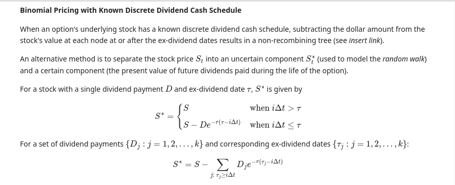
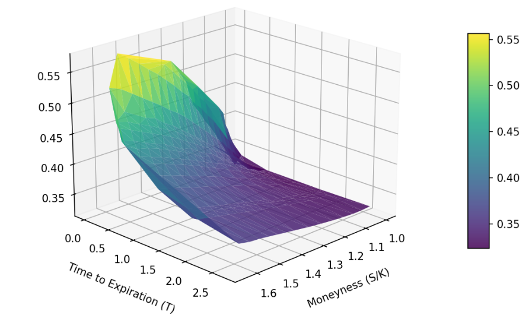

# Quantitative Finance: Derivative Pricing and Volatility Models (C++ & Python)

This repository provides an introduction to the fundamental pricing models used in modern finance.
The repository implements these models for derivative pricing and volatility analysis using C++ and Python.

This repository is designed primarily as a learning and documentation project.

The main deliverable is the rendered documentation site,
which includes mathematical derivations, implementation details,
and numerical experiments.

The goal is to combine:
- mathematical finance theory
- efficient C++ pricing engines
- Python-based experimentation and visualization

The C++ and Python code serves as the computational backend
for the documented models.

## Project Documentation

The full documentation, mathematical derivations, model explanations, 
and performance analysis are available in the rendered HTML site:

➡ **View Documentation:**  
https://alejandronaranjocaraza.github.io/finance_pricing/index.html





## Models Implemented

### Option Pricing

- Black-Scholes-Merton (BSM) model
- Binomial Tree model
- Monte Carlo simulation

### Volatility Models

- Implied volatility
- Volatility smiles and surfaces
- (Planned) Historical volatility
- (Planned) GARCH models

## Repository Structure

```text
├── assets/               # README and repo-wide static assets
│
├── cpp_pricing/          # Pricing engine (C++)
│   ├── src/
│   ├── include/
│   ├── bindings/
│   └── tests/
│
├── cpp_stocksim/         # Stock simulation engine (C++)
│   ├── src/
│   ├── include/
│   ├── bindings/
│   └── tests/
│
├── notebooks/            # Quarto notebooks and analysis
│   ├── index.ipynb
│   ├── stockOverview.ipynb
│   ├── modsOverview.ipynb
│   ├── testCases.ipynb
│   ├── volSmile.ipynb
│   ├── garch/
│   ├── assets/           # notebook-specific assets
│   └── _quarto.yml
│
├── docs/                 # Generated documentation (Quarto output)
│   └── [auto-generated HTML]
│
├── tests/                # Integration tests
│
└── README.md
```

## Technology Used

The pricing engine is written in C++20 and exposed to Python 3.10+ through pybind11.
The documentation and basic implementation examples are done in Jupyter Notebooks and rendered with Quarto.

### Python Libraries

- **NumPy** for pricing algorithms
- **Pandas** for market data handling and manipulation
- **yfinance** for market data extraction
- **pricer**: custom C++ pricer exposed through pybind11
- **stocksim**: custom C++ stock simulator exposed through pybind11
- **IPython** to display images

### C++ Libraries

- **pybind11** to expose custom libraries to Python

## Future Additions

While this repository currently includes two sub-projects (C++ libraries + Jupyter Notebook documentation), it will soon be refactored into two separate repositories. The C++ libraries will also be integrated into one *financial engineering* library and builds will be reproducible through docker.

Other future additions include:

- Futures pricing and simulations in C++ library
- Futures and forwards documentation
- GARCH volatility analysis

## Learning Objectives

This project serves as a personal learning platform focused on:

- Financial engineering concepts
- Object-Oriented Programming in C++
- Memory management in C++
- Runtime polymorphism
- Python-C++ integration using pybind11
- Reproducible infrastructure design

## References

The content is based on the following books:

- Hull, John. Options, Futures, and Other Derivatives. Pearson, 2022.
- Taylor, Stephen. Modelling Financial Time Series. World Scientific, 2013. 

Index
-----

- [C++ pricing engine for python](./docs/volSmile.html)


# LINKS AND REFERENCES

## Books

- [Options, Futures and Other Derivatives - Hull](http://lib.ysu.am/disciplines_bk/2b66030e0dd4c77b2bda437f6c1e5e66.pdf)
    * Instruments basics, prcing and numerical procedures

- [Introduction to Time Series and Forecasting - Brockwell/Davis](https://weblibrary.mila.edu.my/upload/ebook/management%20_and_business/2016_Book_IntroductionToTimeSeriesAndFor.pdf)
    * Basic Time Series thoery & application (R)

- [Modelling Financial Time Series - Taylor]()
    * Combines ARMA / GARCH theory & application

- [Francq & Zakoian – GARCH Models]()
    * Advanced forecasting and model variant

## Websites

- [Quant Guild](https://quantguild.com/)

- [Roman Paolucci YouTube](https://www.youtube.com/@QuantGuild)
    * [Master Volatility with ARCH & GARCH Models - Roman Paolucci](https://www.youtube.com/watch?v=iImtlBRcczA)
 
